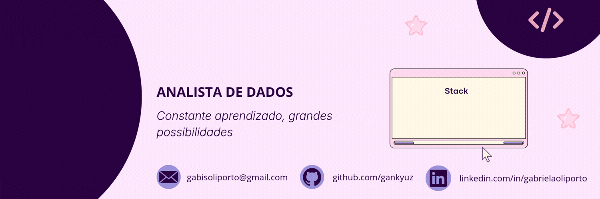

  

#

Estudante de Ciência da Computação, com interesse atual na área de dados, atuando principalmente com Python e suas bibliotecas. Possuo experiências acadêmicas em projetos que envolvem análise e manipulação de dados, aplicando fundamentos computacionais de forma prática. Sou uma pessoa proativa, dedicada e em constante aprimoramento técnico, com foco no desenvolvimento de soluções orientadas a dados.

<h3 align="left">Connect with me!</h3>

[]

<h3 align="left">My Stack ~</h3>

  
  
  
  
  
  
  
  
  
  
  
  
  
  
  
  
  
  

#

<picture align="center">
  <source media="(prefers-color-scheme: dark)" srcset="https://raw.githubusercontent.com/gankyuz/gankyuz/output/github-contribution-grid-snake-dark.svg">
  <source media="(prefers-color-scheme: light)" srcset="https://raw.githubusercontent.com/gankyuz/gankyuz/output/github-contribution-grid-snake-dark.svg">
  
</picture>
